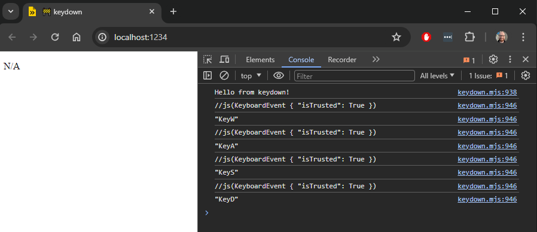

# keydown

Test project to figure out keyboard input for game written in Gleam

## Development

```sh
gleam run -m lustre/dev start
```

Currently the event listener runs and logs debug messages to the console,
but the effect isn't working to update the model.



